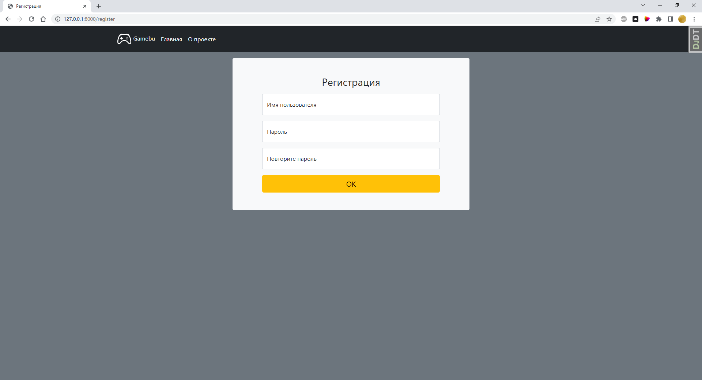
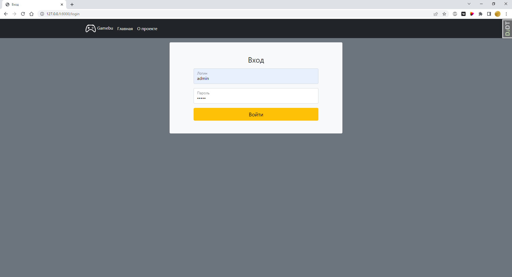
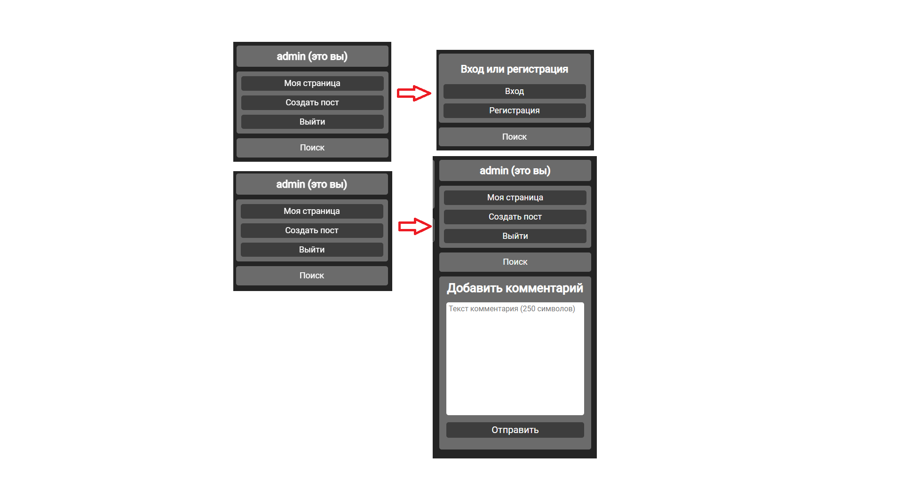
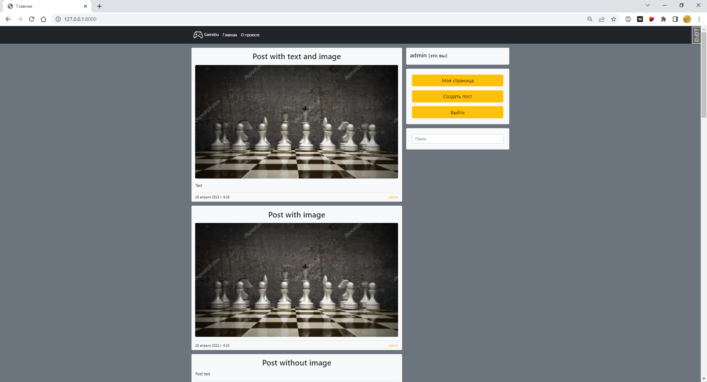
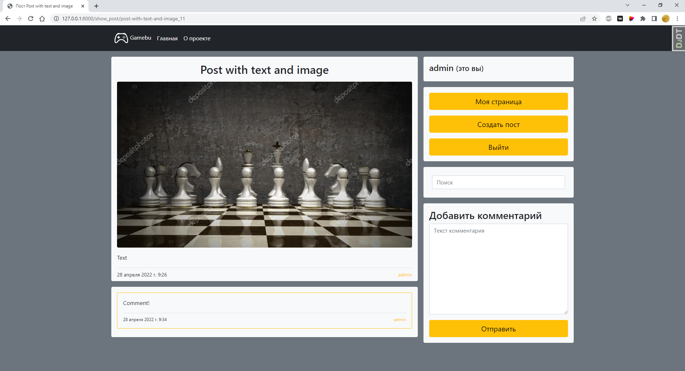
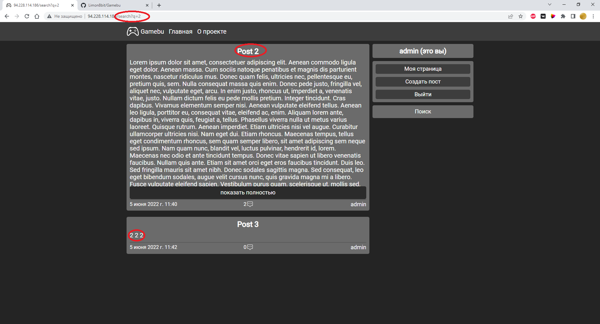

###Title of project: **Gamebu**

### Project description: This project is my first full-size back-end project on django python.
Gamebu - collected view of some sites, main functional is blog, where people can post some card-post with
text, images or combine content. Site functional include oportunity of registration and comment some posts,
checking the author page.
This project maked on Django because its final project of my learning of python language in this time.

###List of contents:

- [X] Registration

- [X] Login

- [X] Logout

- [X] Post some posts with text/image/combine this two.

- [X] Comment posts

- [X] Check the author page using link from post or comment

- [X] Search posts with title or text content with search field

###List of future contents:

- Rating system
- Rework of GET posts system with using new rating system
- Layers system of comments
- Add tags system

###How to install and run:

After download this project you must install python interpreter (3.9+), after this you need to install some 
packet files with pip. For this use terminal in pycharm or command prompt or powershell and move to this 
project folder and use command pip install "requirement packet", where requirement packet it's a packet from this list:

####Requirement packets:
	django
	pillow
	unidecode

After install this packets use command "cd blog" and "python manage.py runserver". Complete!
